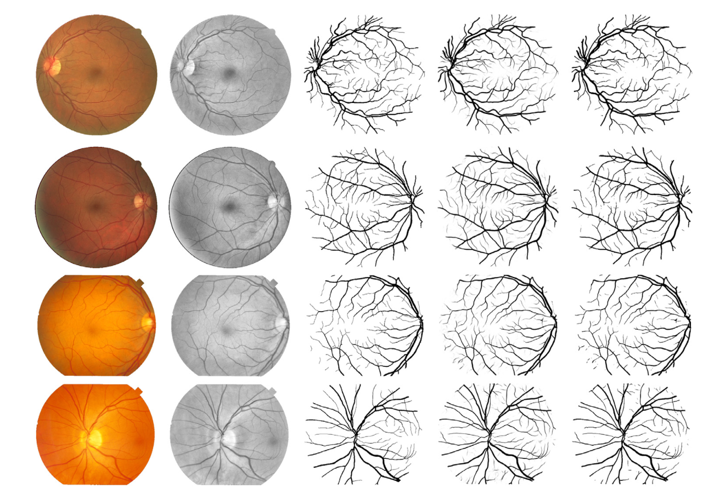

# BSEResU-Net
The Tensorflow-keras Implementation of the [BSEResU-Net: An attention-based before-activation residual U-Net for retinal vessel segmentation](https://www.sciencedirect.com/science/article/abs/pii/S0169260721001450)

## Requirements
- Tensorflow 2.2.0+
- Python 3.6+
- PIL
- scikit-learn
- opencv
- h5py 

## Usage
### Training
- Install this repository and the required packages.
- Prepare dataset
    - Download DRIVE dataset at the the official [website](http://www.isi.uu.nl/Research/Databases/DRIVE/).
    - Create HDF5 datasets of the ground truth, masks and images for both training and testing.
        ```
        python prepare_datasets_DRIVE.py
        ```

- specify configuration in the file `configuration.txt`.
- Train BSEResU-Net
    ```
    python run_training.py
    ```
### Testing
```
python run_testing.py
```

## Results


## Citation
```
@article{li2021bseresu,
  title={BSEResU-Net: An Attention-based Before-activation Residual U-Net for Retinal Vessel Segmentation},
  author={Li, Di and Rahardja, Susanto},
  journal={Computer Methods and Programs in Biomedicine},
  pages={106070},
  year={2021},
  publisher={Elsevier}
}
```

## Acknowledgments
This code is built based on [retina-unet](https://github.com/orobix/retina-unet) and we modified it to be compatible to Tensorflow 2.2+.

## License

This project is licensed under the MIT License


